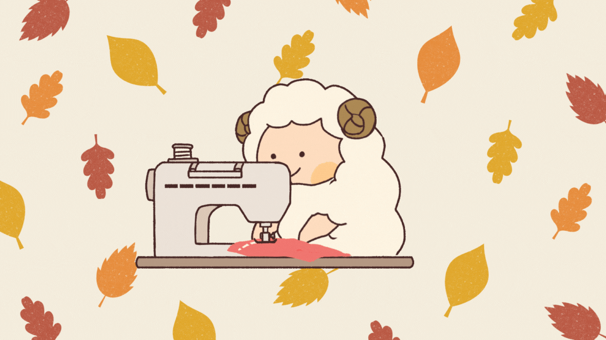

# ひつじさんの秋コーデ工房

## 概要
【秋】をテーマにした、クリックで洋服を仕立てるミニゲームアプリ。
秋といえば、食・スポーツ・読書なと思い浮かべる方が多いと思いますが、私は真っ先に'季節の変化'だと思いました。
暑かった夏から、一気に冬に向かって寒くなる季節、それが私にとっての秋の印象です。
そこで、大きな気温の変化についていこうと思い、洋服を作るミニアプリを作ってみました！

クリック連打で洋服を仕立てるミニゲームです。
秋の気温の変化に対応できるように、たくさんクリックして洋服を作ってみましょう！

## 特徴
- クリックだけで遊べるシンプルなミニゲーム
- 作った洋服をXでシェア可能！
- クリック数もカウントされるので連打自慢もできます！

## 技術スタック
- Ruby on Rails 8.0.2
- Ruby 3.3.6
- Tailwind CSS

## 学習期間
4日間

## 学習目的
- ESBuild（JavaScriptバンドル学習）
- Propshaft / Asset Pipeline
- JavaScript
Railsの基本的な構造と、フロントエンドの動的な動きについて理解を深めようと思い、作成しました。